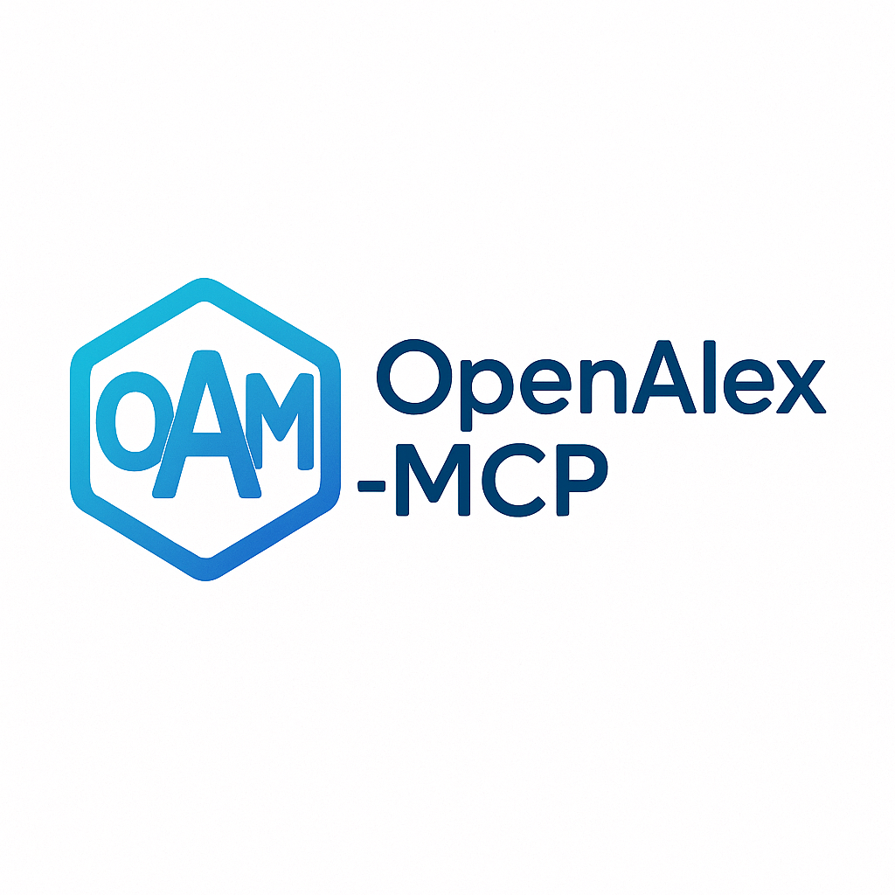

<div align="center">
  
  
  # OpenAlex Author Disambiguation MCP Server

  [](https://modelcontextprotocol.io/)
  [](https://python.org)
  [](https://openalex.org)
  [](LICENSE)
</div>

A professional Model Context Protocol (MCP) server for author disambiguation and institution resolution using the OpenAlex.org API. Built following MCP best practices with FastMCP for clean, maintainable code.

## 🎯 Features

### 🔍 **Core Capabilities**
- **ML-Powered Author Disambiguation** - Leverage OpenAlex's advanced machine learning models
- **Institution Resolution** - Automatic abbreviation expansion (MIT → Massachusetts Institute of Technology)
- **ORCID Integration** - Highest accuracy matching with ORCID identifiers
- **Confidence Scoring** - Detailed confidence analysis with match reasoning
- **Career Analysis** - Automatic career stage determination and metrics

### 🤖 **Agent Optimized**
- **Multiple Candidates** - Return ranked candidates for automated decision-making
- **Rich Metadata** - Comprehensive author profiles with metrics and affiliations
- **Structured Responses** - Clean, parseable output for automated systems
- **Error Handling** - Graceful error handling with informative messages

### 🏛️ **Professional Grade**
- **MCP Best Practices** - Built with FastMCP following official guidelines
- **Tool Annotations** - Proper MCP tool annotations for optimal client integration
- **Resource Management** - Efficient HTTP client management and cleanup
- **Rate Limiting** - Respectful API usage with proper delays

## 🚀 Quick Start

### Prerequisites

- Python 3.10 or higher
- MCP-compatible client (like Claude Desktop)

### Installation

For detailed installation instructions, see [INSTALL.md](INSTALL.md).

1. **Clone the repository:**
   ```bash
   git clone https://github.com/drAbreu/alex-mcp.git
   cd alex-mcp
   ```

2. **Create a virtual environment:**
   ```bash
   python3 -m venv venv
   source venv/bin/activate  # On Windows: venv\Scripts\activate
   ```

3. **Install the package:**
   ```bash
   pip install -e .
   ```

4. **Run the server:**
   ```bash
   ./run_alex_mcp.sh
   ```

## ⚙️ MCP Configuration

### Claude Desktop Configuration

Add to your Claude Desktop configuration file:

```json
{
  "mcpServers": {
    "alex-mcp": {
      "command": "/path/to/alex-mcp/run_alex_mcp.sh"
    }
  }
}
```

Replace `/path/to/alex-mcp` with the actual path to the repository on your system.

## 🛠️ Available Tools

### 🔍 **Author Disambiguation & Search**

#### 1. **disambiguate_author**
Disambiguate an author using OpenAlex's ML-powered system.

**Parameters:**
- `name` (required): Author name
- `affiliation` (optional): Institution name for improved accuracy
- `research_field` (optional): Research field or topic
- `orcid` (optional): ORCID identifier for highest confidence
- `max_candidates` (optional): Maximum candidates to return (1-25, default: 5)

#### 2. **search_authors**
Search for authors with advanced filtering.

**Parameters:**
- `name` (required): Author name to search
- `affiliation` (optional): Filter by institution
- `research_field` (optional): Filter by research field
- `limit` (optional): Maximum results (1-25, default: 10)

#### 3. **get_author_profile**
Get detailed author profile by OpenAlex ID.

**Parameters:**
- `openalex_id` (required): OpenAlex author ID

#### 4. **resolve_institution**
Resolve institution names and abbreviations.

**Parameters:**
- `institution_query` (required): Institution name or abbreviation

**Examples:**
- `MIT` → `Massachusetts Institute of Technology`
- `Stanford` → `Stanford University`
- `Max Planck` → `Max Planck Society`

## 📊 Example Usage

### Author Disambiguation
```python
# Find the correct "Fiona Watt" among multiple researchers
result = await disambiguate_author(
    name="Fiona Watt",
    affiliation="EMBO",
    research_field="stem cell biology"
)
```

**Output:**
```
Found 1 candidate(s) for 'Fiona Watt':

1. Fiona M. Watt
   OpenAlex ID: https://openalex.org/A5068471552
   Confidence: 1.00
   Match reasons: Exact name match, ORCID verified, Affiliation match
   ORCID: https://orcid.org/0000-0001-9151-5154
   Institutions: European Molecular Biology Organization
   Career: Senior Researcher
   Works: 707, Citations: 55,953
   H-index: 126
   Topics: Biology, Genetics, Cell biology
```

### Institution Resolution
```python
# Expand abbreviations automatically
result = await resolve_institution("MIT")
```

**Output:**
```
Institution Resolution for 'MIT':

Best Match: Massachusetts Institute of Technology
OpenAlex ID: https://openalex.org/I63966007
Match Score: 95/100
Country: US
Type: education
Homepage: https://web.mit.edu/
```

## 🏗️ Architecture

### MCP Best Practices
- **FastMCP Framework** - Uses the official FastMCP framework for clean, maintainable code
- **Tool Annotations** - Proper MCP annotations (`readOnlyHint`, `openWorldHint`)
- **Error Handling** - MCP-compliant error responses
- **Resource Management** - Proper startup/shutdown lifecycle management

### Code Structure
```
src/alex_mcp/           # Main package directory
├── __init__.py        # Package initialization
└── server.py          # MCP server implementation
run_server.py           # Script to run the server
run_alex_mcp.sh         # Shell script to run the server in the virtual environment
requirements.txt        # Dependencies
INSTALL.md              # Installation instructions
```

## 📄 License

MIT License - see [LICENSE](LICENSE) file for details.

## 🙏 Acknowledgments

- [OpenAlex](https://openalex.org) for providing the comprehensive academic database
- [Model Context Protocol](https://modelcontextprotocol.io) for the excellent framework
- [FastMCP](https://github.com/modelcontextprotocol/python-sdk) for the clean Python implementation

---

**Built with ❤️ for the research community**
